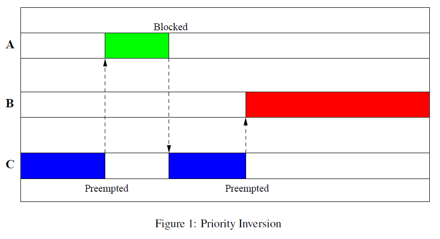
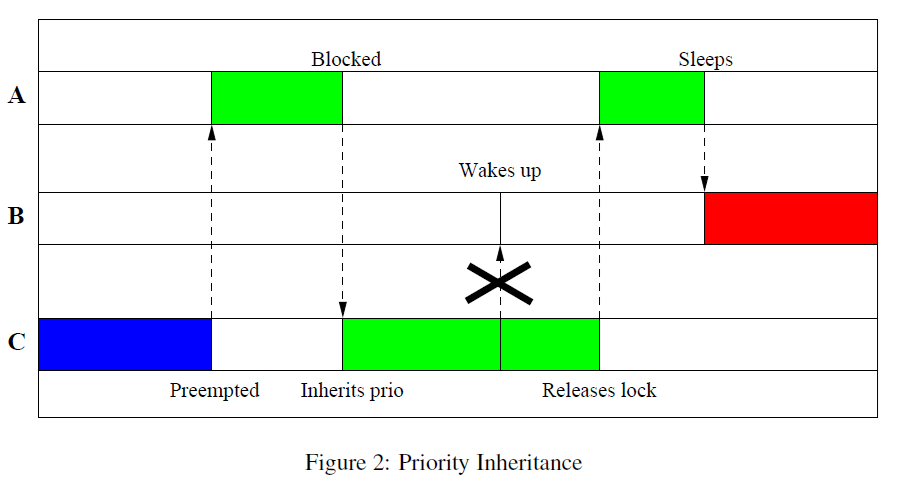

# 优先级反转（priority inversion）
[参考 1] Internals of the RT Patch, Steven Rostedt, Darren V. Hart, 2007

正常情况下，高优先级的任务应该能够及时抢占低优先级的任务才对，但某些条件下，也会发生高优先级的任务抢占低优先级的任务而不得不等待低优先级的任务执行完才能获得处理器并执行，这就是所谓的优先级反转。
发生优先级反转需要满足如下条件：
* 高优先级的任务喝低优先级的任务共享某些资源（譬如：互斥量mutex或者自旋锁spinlock）
* 这些共享资源被低优先级任务先获得而高优先级任务不得不等待。

只要上述条件满足，就会发生优先级反转，这是无法避免的。

问题1：需要解决无限制优先级反转，高优先级的任务可能被低优先级的任务阻塞，但阻塞的时长只要是可控的（譬如低优先级任务可以预期快速完成其工作并释放共享资源），反之，如果阻塞时间对于高优先级任务来说存在不确定的情况，那么就需要注意任务的延迟问题。

上图分析：
这个例子的三个任务的优先级为：A>B>C，且假设一个处理器。
A和C共享资源（譬如一个lock）。发生的无限制优先级反转时序如下：
1. 假设C先唤醒并获取这个lock
2. 然后A唤醒，抢占C并尝试获取lock失败，进入Blocked状态
3. C继续执行
4. 此后，**在C还为来得及释放lock之前**被B抢占。B虽然优先级低于A，但是A却无法抢占B，因为A在等待C释放lock。此时，因为B优先级高于C，只要B不主动释放处理器，C是没有机会释放lock的，这就造成一个现象，就是A优先级高于B，但本质上B却无法一直被A抢占，在A和B之间实际上发生了优先级反转。更糟糕的是，B的出现完全独立于A和C，它是一个完全不受我们控制的任务（A和C存在资源共享，实际上存在预期性）。这导致了A和B之间的优先级反转关系很大可能升级为“无限制优先级反转”，极端条件B进入死循环，那么A永远无法抢占CPU执行。

## 优先级继承（Priority Inheritance）

linux中解决优先级反转（严格说解决无限制优先级反转）的方案是优先级继承。
优先级继承核心思想：当高优先级的任务A因为资源的问题被一个低优先级的任务C阻塞，我们需要临时提高C的优先级与被阻塞的高优先级的任务A的优先级一致（就好像低优先级的任务继承了高优先级任务的优先级一样），这样一来，原优先级的任务C就不会被其他优先级低于A的任务B抢占，这样C就有机会释放lock，A就可以不被B反转。当然C让出处理器的同时，继承的优先级会恢复到原先的值，这样也不会阻碍B继续抢占C。
