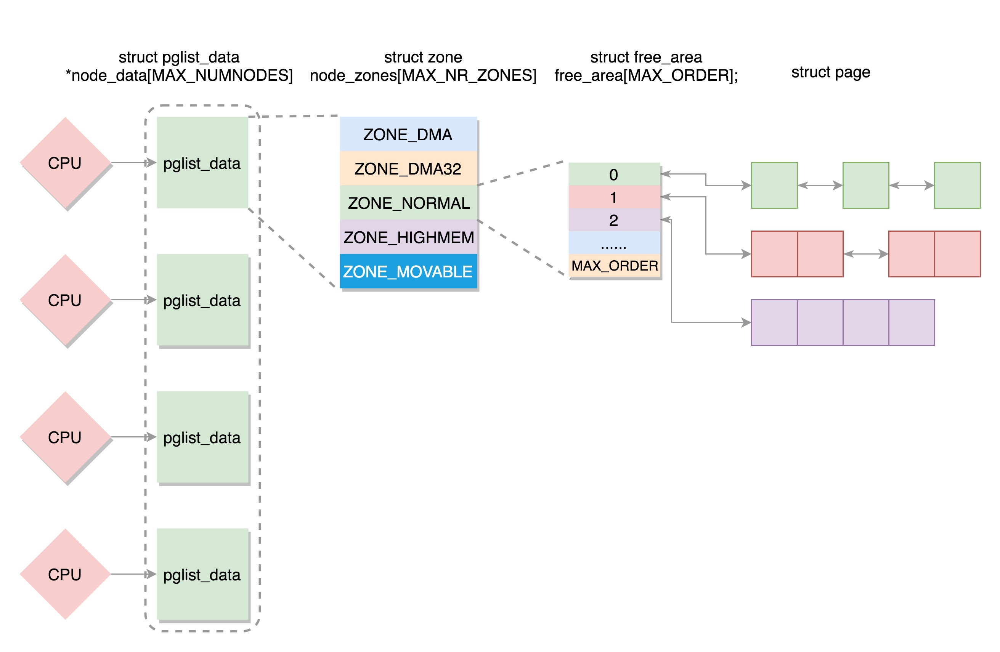
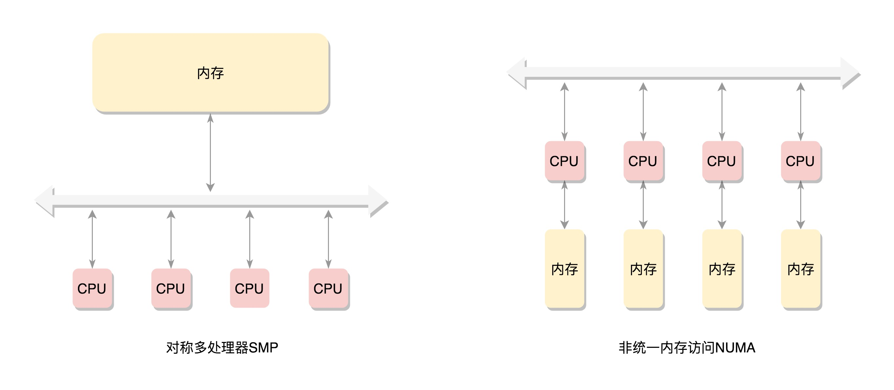

## 物理内存的三级管理结构
linux内核将物理内存管理对象分为节点、区和页框三个层次。

NUMA体系架构处理器中拥有各自本地内存节点（即分布式内存）每个物理内存对应一个节点描述符，其中包含相应内存节点的标识符、起始页框号、页框数等字段。

NUMA:如果有多个CPU，就对应多个节点。每个节点用struct pglist_data表示，放在一个数组里面。
每个节点分为多个区域，每个区域用struct zone表示，也放在一个数组里面；
每个区域分为多个页，为了方便管理，空闲页放在struct free_area里面，使用伙伴系统进行管理和分配，每一页用struct page表示。

物理内存的组织方式：非对称内存访问节点->区->页。
对于要分配比较大的内存，例如到分配页级别的，可以使用伙伴系统（Buddy System）

多个CPU，总线一侧。所有内存条组成一个大内存，在总线的一侧，所有CPU访问内存都要通过总线，这种模式SMP。
缺点：总线会成为瓶颈，因为数据都要走它。

NUMA：为了解决总线瓶颈，非一致性内存访问。

### NUMA详解
《linux内核伙伴系统分析》