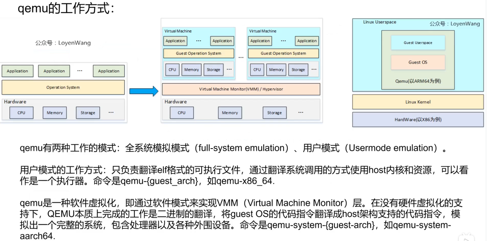

qemu使用方法：
qemu-system-aarch64 -machine type=virt -device help
查看设备支持哪些？



# 网络配置模式
1. user 模式：
用户协议栈方式，原理是在qemu的进程中实现一个协议栈，这个协议栈被视为host和qemu之间的NAT（network address translation）服务器，将qemu所模拟系统的网络请求转发到host的网卡上面，从而实现网络通信。

```bash
a. /sys/firmware/fdt        // 原始dtb文件

hexdump -C /sys/firmware/fdt

b. /sys/firmware/devicetree // 以目录结构程现的dtb文件, 根节点对应base目录, 每一个节点对应一个目录, 每一个属性对应一个文件

c. /sys/devices/platform    // 系统中所有的platform_device, 有来自设备树的, 也有来有.c文件中注册的
   对于来自设备树的platform_device,
   可以进入 /sys/devices/platform/<设备名>/of_node 查看它的设备树属性

d.  /proc/device-tree 是链接文件, 指向 /sys/firmware/devicetree/base
```