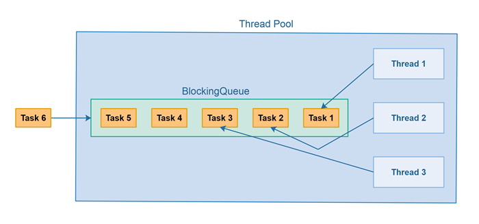

## 线程池是什么
线程池是基于池化思想管理线程的工具，经常出现在多线程服务器中。
线程过多会带来额外的开销，其中包括创建销毁线程的开销、调度线程的开销等等，同事也降低了计算机的整体性能。线程池维护多个线程，等待监督管理者分配可并发执行的任务。 
这种做法，一方面避免了处理任务时创建销毁开销代价，另一方面避免了线程数量膨胀导致过分调度问题，保证了对内核的充分利用。

使用线程池可以带来一系列好处：
* 降低资源消耗（系统资源）：通过池化技术重复利用已创建的线程，降低线程创建和销毁造成的损耗。
* 提高线程的可管理性（系统资源）：线程时稀缺资源，如果无限制,不仅会消耗系统资源，还会因为线程的不合理分布导致资源调度失衡，降低系统的稳定性。使用线程池可以进行统一的分配、调优和监控。
* 提高响应速度（任务响应）：任务到达时，无需等待线程创建即可立即执行。
* 提供更多更强大的功能（功能扩展）：线程池具备可拓展性，允许开发人员向其中增加更多的功能。比如延时定时线程池。

## 线程池使用场景
某类任务特别耗时，严重影响其他线程处理其他任务；
在其他线程异步执行该函数
线程资源的开销与CPU核数之间平衡选择；

### 线程池的作用
复用线程资源
减少线程创建和销毁的开销
可异步处理生产者线程任务
减少了多个任务的执行时间

### 如何创建一个线程池

[线程池](https://blog.csdn.net/qq_36359022/article/details/78796784)

## 

