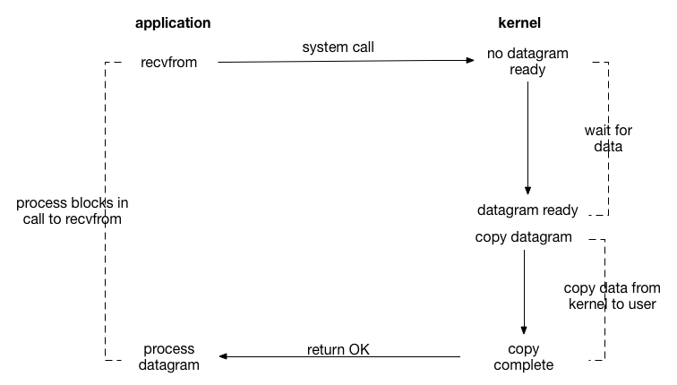
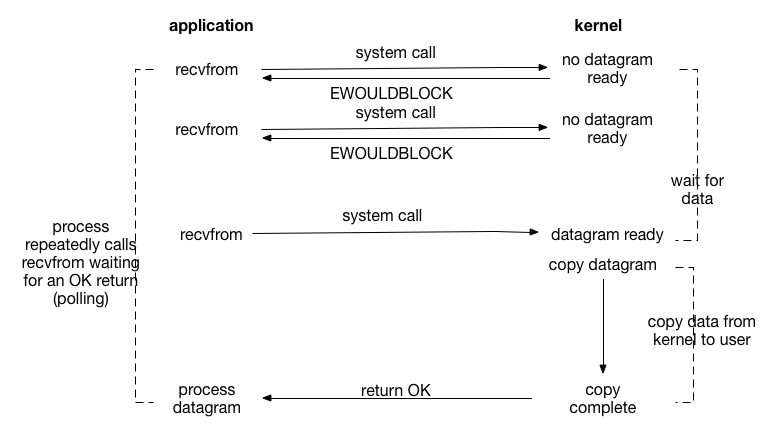

# 概述
IO模型的选择在Linux网络编程中十分重要。在linux环境中主要提供了五种不同的IO模型，分别是：
* 阻塞式IO
* 非阻塞式IO
* IO多路复用
* 信号驱动方式IO
* 异步IO

通常一个输入操作包含两个不同阶段：
1. 等待数据准备好
2. 从内核向进程复制数据

例如，一个网络套接字上的输入操作，第一步通常涉及到发生系统调用，用户态切换到内核态并等待数据从网络中到达，当所有等待分组到达时，数据会复制到内核中的某个缓冲区。第二步则是数据从内核缓冲区复制到应用进程缓冲区。
## 基本概念

# 阻塞IO模型
在linux中，所有socket默认情况下都是阻塞的。这里有必要辨析以下阻塞和非阻塞这两个概念，这两个概念描述的是用户线程调用内核IO操作方式，其中阻塞时指I/O操作需要彻底完成后才返回到用户空间；而非阻塞式指IO操作北调用后立即返回给用户一个状态值，不需要等待IO操作彻底完成。

阻塞非阻塞

同步异步

多路复用

# 异步IO模型

